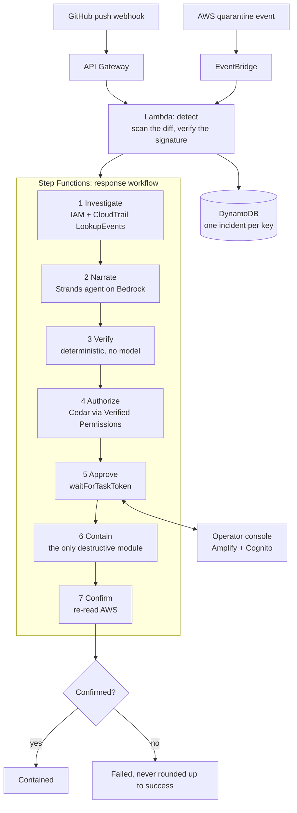

# KILLSWITCH

> Your AWS keys leaked. KILLSWITCH pulls the plug.

A leaked-credential responder: it catches an AWS key the moment it escapes, shows exactly what the attacker did with it, and after one human approval kills the key, terminates what the attacker launched and opens a PR that removes the secret.

Built for [First Commit](https://www.wemakedevs.org/aws/first-commit) (WeMakeDevs x AWS Builder Center), 17 to 20 September 2026, Ship It track.

**Live console:** not deployed yet
**Demo video (3 min):** not recorded yet

> Read [Limitations](#limitations) before you read anything else. Nothing in this repository has ever run against AWS.

---

## The problem

Unit 42 tracked attackers pulling AWS keys off GitHub **within five minutes** of exposure, then launching EC2 instances across regions about seven minutes later. AWS auto-quarantines some leaked keys, but only the ones it detects, and quarantine does not terminate what the attacker already launched, clean your repository, or tell you what happened. For a student on a free-tier account, the first sign is the bill.

The tools that exist mostly *alert*. Somebody still has to work out what the key touched, decide what to destroy, destroy it, and check it worked — at 2am, under time pressure, from whatever device is to hand.

## Architecture



Two triggers, one idempotent workflow. Whichever fires first does the work; the second finds the incident already open.

## The rule the system is built on

**The model proposes. Plain code verifies. A human approves.**

- The Strands agent on Bedrock writes prose and proposes actions. It is given **no tools**, so it has nothing to act with.
- `verifier/` is ordinary Python. No AWS calls, no model calls — enforced by a test that parses the module and fails on a `boto3`, `strands` or HTTP import. It re-checks every proposed action against CloudTrail and drops anything the leaked key did not create, with a machine-readable reason the console renders.
- `containment/` is the only module that destroys anything, and every function in it refuses to run without an approval token scoped to that exact action **and** that exact approval round. A decision from a superseded round authorises nothing.
- The synthesized CloudFormation template is asserted to grant `ec2:TerminateInstances` and `iam:UpdateAccessKey` in exactly one statement, so the safety boundary is checked by CI rather than by reading the code.

What the verifier does **not** catch is written down, unflatteringly, in [docs/VERIFIER-LIMITS.md](docs/VERIFIER-LIMITS.md). The short version: it cannot see omission, and it cannot stop the model talking to the human.

## Safety model

```
READS                            HUMAN GATE                    WRITES
CloudTrail, IAM, repo diff  ──►  per-action approval  ──►  deactivate key
                                 (Cedar decides which)      terminate instances
                                                            open PR
                                                                 │
                                                                 ▼
                                                       post-action verification
                                                            + audit record
```

Concretely:

| Guard | Where it lives | Checked by |
|---|---|---|
| The model gets one turn and cannot retry past the schema | `narrate/agent.py` | `tests/test_narrate.py` |
| The narrator has no tools | `narrate/agent.py` | `tests/test_narrate.py` |
| Only key-created resources may be targeted | `verifier/verify.py` | 21 tests in `tests/test_verifier.py` |
| Destructive actions need a human | `authorize/policies/containment.cedar` | `tests/test_authorize.py` |
| Nothing destroys without a scoped approval token | `containment/guard.py` | `tests/test_containment.py` |
| One IAM statement in the stack may destroy | `infra/stacks/response.py` | `tests/test_response_stack.py` |
| Unconfirmed end state fails the execution | `infra/stacks/response.py` | `tests/test_response_stack.py` |

## AWS services used

| Service | Job |
|---|---|
| API Gateway | Receives the repository push webhook, HMAC-verified |
| EventBridge | Second trigger, on AWS's quarantine event |
| Lambda | Detection, investigation, narration, verification, containment |
| Step Functions | Orchestration, and the `waitForTaskToken` human approval |
| Amazon Bedrock + Strands Agents SDK | Incident summary and proposed plan |
| Amazon Verified Permissions | Cedar policy deciding which actions need a human |
| CloudTrail | The evidence the whole investigation stands on |
| DynamoDB | Incident state, approvals and the append-only audit log |
| IAM | Key identification and deactivation |
| Amplify Hosting + Cognito | The operator console and its login |

## Quickstart

```bash
cp .env.example .env          # fill it in, never commit it
make install                  # uv venv on Python 3.12 + dev toolchain
make console-install          # npm install inside console/
make check                    # secrets, ruff, mypy, pytest, console tests, console build
```

To see the console without an AWS account:

```bash
cd console && npm run dev     # fixture mode, with a banner saying so on screen
```

Every AWS command — creating the demo account, deploying the four stacks, minting the demo
key, running the attack and recording the video — is a human's, and is written out step by
step in [docs/RUNBOOK.md](docs/RUNBOOK.md).

## Tests

```bash
make test           # 256 Python tests
make check          # the full gate, including the console
```

The tests worth looking at:

- `tests/test_verifier.py` — the accept path, the reject path, and a test that parses `verifier/verify.py` and fails if it ever imports an AWS or model SDK.
- `tests/test_containment.py` — every destructive function refusing to act without a scoped approval token, and recording the refusal.
- `tests/test_narrate.py` — the narrator's schema, the one-turn decision, and the rehearsal plan running end to end into the verifier, which strikes exactly one action.
- `tests/test_response_stack.py` — the workflow's shape as a safety property, asserted on the synthesized template.
- `tests/test_workflow_end_to_end.py` — the whole chain, narrate to confirm, against in-memory AWS. An approved action runs, a denied one leaves its target untouched, and the execution ends unconfirmed because that instance is still running.

Saved output and console screenshots are in [evidence/](evidence/).

## Limitations

This section is the honest one. Judges asked for it; so did we.

**Nothing has ever run against AWS.** No stack is deployed, no key has leaked, no CloudTrail
event has been read, no Bedrock model has been called, no Step Functions execution has
started, and the approve button has never released a real task token. Every test in this
repository runs against in-memory fakes and stub agents. Read every "it does X" above as
"the code for X is written and unit-tested".

Specifically:

1. **The CloudTrail fixtures are synthetic.** `tests/fixtures/*.json` were written by hand to
   the exact `LookupEvents` shape, not captured from AWS. `scripts/capture_fixture.py` exists
   to replace them with real scrubbed captures after the first demo run, and until then the
   blast radius has only been tested against evidence we invented. `tests/fixtures/README.md`
   says the same thing next to the files.
2. **The GitHub PR opener is not built.** `containment/open_pull_request` works and is tested,
   but the function injected into it raises `NotImplementedError`, so the action records a
   failure rather than returning a URL nobody opened. This is cut-list item 2 in
   `docs/PLAN.md`. The narrator is told not to propose it.
3. **The second trigger cannot fire for real in this demo.** AWS only quarantines keys it
   finds in *public* exposure, and safety rule 4 keeps the demo repository private on
   purpose. `scripts/simulate_quarantine.py` fires the event shape by hand. That is a
   simulation, done openly, not the real AWS trigger.
4. **IAM's CloudTrail events only reach EventBridge in us-east-1.** The quarantine rule
   therefore only fires for real if the detection stack is deployed there, whatever the
   primary region is set to.
5. **The verifier cannot detect omission.** A model that proposes nothing passes every check,
   because an empty plan is valid. The console highlights resources with no proposed action
   and the schema makes the model state an empty plan rather than omit the field, but neither
   is a check. The full list of what gets past the verifier is in
   [docs/VERIFIER-LIMITS.md](docs/VERIFIER-LIMITS.md).
6. **The narrator gets exactly one turn.** Strands, on Bedrock, hands a schema failure back
   to the model as a tool error so it can retry. We switch that off, deliberately, so the
   component we do not trust cannot negotiate with the validator. The cost is that Strands'
   second-turn nudge for a model that replied in prose is disabled too, so such a reply fails
   the step. Whether a real model satisfies this schema first time has never been measured.
7. **The webhook secret is a Lambda environment variable**, not Secrets Manager. It is
   readable by anyone with `lambda:GetFunctionConfiguration` on the account, and it does not
   rotate. Fine for a throwaway demo account, wrong for anything else.
8. **The cost-avoided figure is an estimate at list price**, not a measurement. It is
   instance count x 720 hours x $0.0112, the on-demand `t3.micro` rate in `ap-south-1`
   hardcoded at the time of writing, not a live price feed. It is not a bill, and it
   accounts for nothing else the attacker might have run.
9. **It only understands `RunInstances`.** `CREATION_EVENTS` in `investigate/blast_radius.py`
   maps one event to one resource kind. A key used to create IAM users, S3 buckets, Lambda
   functions or anything else produces an empty blast radius, and KILLSWITCH would report a
   leak with nothing to contain — which reads exactly like a clean incident.
10. **The lookup window is three hours across two regions.** Anything the key did outside
    that never enters the evidence, and the verifier will then reject an action against it as
    "not in the blast radius": the right answer for the wrong reason.
11. **There is one approval round and a one-hour timeout.** If nobody answers, the execution
    fails and nothing is destroyed — the safe direction, but also a dead incident with no
    retry path.
12. **It has only ever been tested at demo scale**, which is two instances. Nothing here
    reasons about a key that launched two hundred.
13. **The narrator's `bedrock:InvokeModel` grant is on `Resource: "*"`.** The action is the
    narrowest one Bedrock has and cannot read, write or destroy anything, but the narrator
    Lambda could invoke any model in the account, not only the one `BEDROCK_MODEL_ID` names.
    Scoping it means building foundation-model and inference-profile ARNs, and cross-region
    inference profiles make that easy to get wrong, so it was left wide on purpose. The
    exposure is spend, not access.

## Credits and AI tools

See [docs/CREDITS.md](docs/CREDITS.md) and [docs/AI-TOOLS.md](docs/AI-TOOLS.md).
