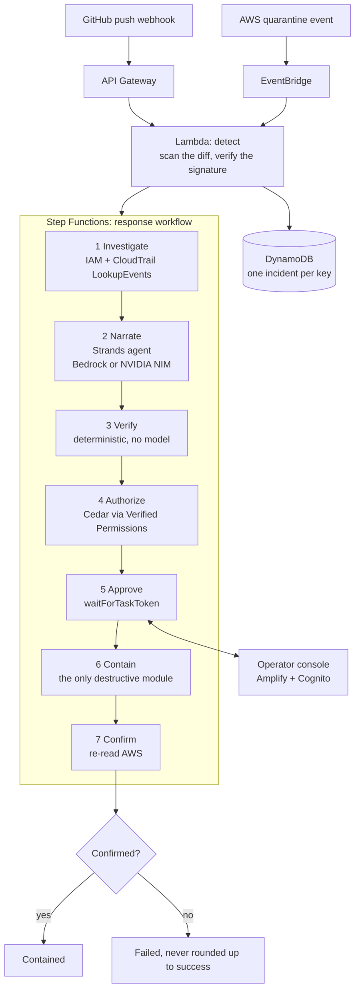

# KILLSWITCH

> Your AWS keys leaked. KILLSWITCH pulls the plug.

A leaked-credential responder: it catches an AWS key the moment it escapes, shows exactly what the attacker did with it, and after one human approval kills the key, terminates what the attacker launched and opens a PR that removes the secret.

Built for [First Commit](https://www.wemakedevs.org/aws/first-commit) (WeMakeDevs x AWS Builder Center), 17 to 20 September 2026, Ship It track.

**Live console:** not deployed yet
**Demo video (3 min):** not recorded yet

> Read [Limitations](#limitations) before you read anything else. Nothing in this repository has ever run against AWS, and the list is 22 items long.

---

## The problem

Unit 42 tracked attackers pulling AWS keys off GitHub **within five minutes** of exposure, then launching EC2 instances across regions about seven minutes later. AWS auto-quarantines some leaked keys, but only the ones it detects, and quarantine does not terminate what the attacker already launched, clean your repository, or tell you what happened. For a student on a free-tier account, the first sign is the bill.

The tools that exist mostly *alert*. Somebody still has to work out what the key touched, decide what to destroy, destroy it, and check it worked — at 2am, under time pressure, from whatever device is to hand.

## Architecture



Two triggers, one idempotent workflow. Whichever fires first does the work; the second finds the incident already open.

## The rule the system is built on

**The model proposes. Plain code verifies. A human approves.**

- The Strands agent writes prose and proposes actions. It is given **no tools**, so it has nothing to act with. It runs on Amazon Bedrock or, with `NARRATOR_MODE=nim`, on NVIDIA NIM — the provider is swappable precisely because nothing downstream trusts it.
- `verifier/` is ordinary Python. No AWS calls, no model calls — enforced by a test that parses the module and fails on a `boto3`, `strands` or HTTP import. It re-checks every proposed action against CloudTrail and drops anything the leaked key did not create, with a machine-readable reason the console renders.
- `containment/` is the only module that destroys anything, and every function in it refuses to run without an approval token scoped to that exact action **and** that exact approval round. A decision from a superseded round authorises nothing.
- The synthesized CloudFormation template is asserted to grant `ec2:TerminateInstances` and `iam:UpdateAccessKey` in exactly one statement, so the safety boundary is checked by CI rather than by reading the code.

What the verifier does **not** catch is written down, unflatteringly, in [docs/VERIFIER-LIMITS.md](docs/VERIFIER-LIMITS.md). The short version: it cannot see omission, and it cannot stop the model talking to the human.

## Safety model

```
READS                            HUMAN GATE                    WRITES
CloudTrail, IAM, repo diff  ──►  per-action approval  ──►  deactivate key
                                 (Cedar decides which)      terminate instances
                                                            open PR
                                                                 │
                                                                 ▼
                                                       post-action verification
                                                            + audit record
```

Concretely:

| Guard | Where it lives | Checked by |
|---|---|---|
| The model gets one turn and cannot retry past the schema | `narrate/agent.py` | `tests/test_narrate.py` |
| The narrator has no tools | `narrate/agent.py` | `tests/test_narrate.py` |
| Only key-created resources may be targeted | `verifier/verify.py` | 21 tests in `tests/test_verifier.py` |
| Destructive actions need a human | `authorize/policies/containment.cedar` | `tests/test_authorize.py` |
| Nothing destroys without a scoped approval token | `containment/guard.py` | `tests/test_containment.py` |
| One IAM statement in the stack may destroy | `infra/stacks/response.py` | `tests/test_response_stack.py` |
| Unconfirmed end state fails the execution | `infra/stacks/response.py` | `tests/test_response_stack.py` |

## AWS services used

| Service | Job |
|---|---|
| API Gateway | Receives the repository push webhook, HMAC-verified |
| EventBridge | Second trigger, on AWS's quarantine event |
| Lambda | Detection, investigation, narration, verification, containment |
| Step Functions | Orchestration, and the `waitForTaskToken` human approval |
| Amazon Bedrock + Strands Agents SDK | Incident summary and proposed plan. Swappable for NVIDIA NIM via `NARRATOR_MODE=nim`, for accounts without Bedrock model access |
| Amazon Verified Permissions | Cedar policy deciding which actions need a human |
| CloudTrail | The evidence the whole investigation stands on |
| DynamoDB | Incident state, approvals and the append-only audit log |
| IAM | Key identification and deactivation |
| Amplify Hosting + Cognito | The operator console and its login |

## Quickstart

```bash
cp .env.example .env          # fill it in, never commit it
make install                  # uv venv on Python 3.12 + dev toolchain
make console-install          # npm install inside console/
make check                    # secrets, ruff, mypy, pytest, console tests, console build
```

To see it without an AWS account:

```bash
cd console && npm run dev     # fixture mode, with a banner saying so on screen
```

That serves two views out of one React app. `/` is the public page — the problem, the
three-stage safety model and the guard table. `/#console` is the operator console, which
opens on the bundled fixture: two instances in two regions, one action the verifier struck
out, and one resource the plan proposed nothing for. A named incident (`?incident=<id>`)
opens the console directly.

Every AWS command — creating the demo account, deploying the four stacks, minting the demo
key, running the attack and recording the video — is a human's, and is written out step by
step in [docs/RUNBOOK.md](docs/RUNBOOK.md).

## Tests

```bash
make test           # 334 Python tests
make check          # the full gate, including the console's 16 tests
```

The tests worth looking at:

- `tests/test_verifier.py` — the accept path, the reject path, and a test that parses `verifier/verify.py` and fails if it ever imports an AWS or model SDK.
- `tests/test_containment.py` — every destructive function refusing to act without a scoped approval token, and recording the refusal.
- `tests/test_narrate.py` — the narrator's schema, the one-turn decision, and the rehearsal plan running end to end into the verifier, which strikes exactly one action.
- `tests/test_response_stack.py` — the workflow's shape as a safety property, asserted on the synthesized template.
- `tests/test_workflow_end_to_end.py` — the whole chain, investigate to confirm, against in-memory AWS. An approved action runs, a denied one leaves its target untouched and ends the incident `declined` rather than `failed`, and a first CloudTrail lookup that finds nothing sends the workflow back to wait instead of narrating an empty plan. This file found three seam bugs the module tests could not see.
- `tests/test_start_workflow.py` — the wire between detection and the workflow, which for most of this project's life did not exist. Also the reason a redelivered stream record cannot start a second execution.
- `tests/test_narrate_adversarial.py` — the model proposing what it should not: a hallucinated instance, the right instance in the wrong region, someone else's key, an action type KILLSWITCH does not have, and six targets that are not well-formed ids. Every one is struck out by plain code before a human sees a button.
- `tests/test_integration_wiring.py` — a signed GitHub push becoming a contained incident with nothing seeded: detect, the table stream, the starter, every stage, the console's API, containment, confirmation. Includes the deny path, the nobody-answered path, the superseded-token path, and a check that the runner follows the same state order as the synthesized definition.

Saved output and screenshots of both views are in [evidence/](evidence/).

## Limitations

This section is the honest one. Judges asked for it; so did we. It got longer after an
adversarial review pass, which is the direction it should move in.

**Nothing has ever run against AWS.** No stack is deployed, no key has leaked, no CloudTrail
event has been read, no Bedrock model has been called, no Step Functions execution has
started, and the approve button has never released a real task token. Every test in this
repository runs against in-memory fakes and stub agents. Read every "it does X" above as
"the code for X is written and unit-tested".

That matters more than it sounds. Two review passes have now found bugs that only exist at
the seams between modules, and the worst one was structural: **nothing started the
workflow at all.** Detection wrote an incident to DynamoDB and stopped. Every module test
passed throughout, because every test called the workflow tasks directly. The incident
table now streams into `workflow/start.py`, and `tests/test_start_workflow.py` and
`tests/test_response_stack.py` assert the wire exists — but a chain of fakes is still a
chain of fakes.

### What we know is wrong, and have not fixed

1. **CloudTrail is minutes behind, so KILLSWITCH is too.** AWS delivers management events
   to `LookupEvents` typically within 15 minutes. Detection happens seconds after a push.
   Investigate is therefore a poll — `Wait` 60s, retry, up to 15 attempts — and the demo's
   "5 minutes to compromise" framing does **not** mean 5 minutes to containment. It means
   containment starts when the evidence lands. A first lookup that finds nothing is the
   expected case, not a clean incident.
2. **An unresolved search is not proof of a clean one.** When the poll gives up empty, the
   blast radius records `evidence_not_yet_available` per region rather than returning an
   empty list, so `evidence_incomplete` reaches the screen. That makes the gap visible. It
   does not make it go away.
3. **Role chaining defeats the blast radius entirely.** We look up CloudTrail by one
   `AccessKeyId`. An attacker who calls `sts:AssumeRole` or `sts:GetSessionToken` first
   acts under a different key id, and everything they then create is invisible to us. The
   incident would look clean. This is the single largest evidence gap in the project.
4. **Attacker persistence is only half covered.** `CreateAccessKey` is now evidence:
   a key the leaked key minted appears in the blast radius, the verifier will approve
   deactivating it, and containment resolves its owner separately because it is not the
   incident's user. `CreateUser`, `AttachUserPolicy`, `CreateRole` and console passwords
   are still invisible, so an attacker with a second route in keeps it.
5. **Nothing re-investigates during the approval wait.** The blast radius is built once.
   An attacker who launches more instances while a human is deciding is never seen, and
   the verifier would reject an action against them as "not in the blast radius".
6. **The verifier cannot detect omission.** A model that proposes nothing passes every
   check, because an empty plan is valid. The console highlights resources with no proposed
   action and the schema makes the model state an empty plan rather than omit the field,
   but neither is a check. The full list is in [docs/VERIFIER-LIMITS.md](docs/VERIFIER-LIMITS.md).
7. **It understands two creation events.** `RunInstances` and `CreateAccessKey`. A key
   used to create S3 buckets, Lambda functions, RDS instances or anything else produces a
   blast radius that is empty of them, and KILLSWITCH would report a leak with nothing to
   contain — which reads exactly like a clean incident. This is still the most dangerous
   limitation in the project, because its failure mode is silence.
8. **It has no answer to an Auto Scaling group.** Terminating an instance that something
   else replaces confirms successfully and changes nothing. We do not look for the thing
   doing the replacing.
9. **One approval round, one-hour timeout, one click per action.** If nobody answers, the
   execution fails and nothing is destroyed — the safe direction, but a dead incident with
   no retry path. And the console requires a decision per action before it will send, so an
   incident with two hundred instances is two hundred clicks. Nothing here reasons about
   that scale; it has only ever been exercised with two.
10. **Any authenticated operator can approve any incident.** API Gateway enforces a Cognito
    authorizer on both routes, so the approval endpoint is not open to the internet. But
    there is no authorization beyond that: no roles, no ownership, no four-eyes rule.
11. **The audit trail is append-only by convention, not by enforcement.** Rows are separate
    items so concurrent writers cannot clobber each other, but the containment Lambda holds
    read-write on the table and DynamoDB has no object lock. Do not read it as tamper-proof.
12. **The GitHub PR opener is not built.** `containment/open_pull_request` works and is
    tested, but the function injected into it raises `NotImplementedError`. The end state
    now reports such an action as `NoPullRequestRecorded` rather than confirming it — a bug
    the review pass caught, where the one module that exists to refuse unverified success
    was granting it. This is cut-list item 2 in `docs/PLAN.md`; the narrator is told not to
    propose it.
13. **The CloudTrail fixtures are synthetic.** `tests/fixtures/*.json` were written by hand
    to the exact `LookupEvents` shape, not captured from AWS. `scripts/capture_fixture.py`
    exists to replace them with real scrubbed captures after the first demo run.
14. **The second trigger cannot fire for real in this demo.** AWS only quarantines keys it
    finds in *public* exposure, and safety rule 4 keeps the demo repository private on
    purpose. `scripts/simulate_quarantine.py` fires the event shape by hand. That is a
    simulation, done openly, not the real AWS trigger. Relatedly, IAM's CloudTrail events
    only reach EventBridge in `us-east-1`, so the rule only fires for real if the detection
    stack is deployed there.
15. **The narrator can run on NVIDIA NIM instead of Bedrock**, for accounts that cannot get
    Bedrock model access. It is the same agent, the same schema and the same one-turn
    limit; only the provider changes, and the verifier does not know or care which ran.
    Two costs come with it: the NVIDIA key is a long-lived credential sitting in a Lambda
    environment variable (scoped to the narrator function alone, but still readable by
    anyone with `lambda:GetFunctionConfiguration`), and the Lambda asset grows from 71 MB
    to 191 MB unzipped because `litellm` is 98 MB — under the 250 MB limit, with less
    headroom than before. Neither path has ever been run.
16. **The narrator gets exactly one turn.** Strands hands a schema failure back
    to the model as a tool error so it can retry. We switch that off, deliberately, so the
    component we do not trust cannot negotiate with the validator. The cost is that a model
    replying in prose fails the step. Whether a real model satisfies this schema first time
    has never been measured.
17. **The webhook secret is a Lambda environment variable**, not Secrets Manager. It is
    readable by anyone with `lambda:GetFunctionConfiguration` on the account, and it does
    not rotate. Fine for a throwaway demo account, wrong for anything else. The scanner
    itself only matches `AKIA…`: an encoded, split or `ASIA` credential goes straight past.
18. **The cost-avoided figure is an estimate at list price**, not a measurement. Instance
    count x 720 hours x $0.0112, hardcoded, not a live price feed. It is not a bill.
19. **The lookup window is three hours across two regions.** Anything outside it never
    enters the evidence, and the verifier will then reject an action against it as "not in
    the blast radius": the right answer for the wrong reason.
20. **The narrator's `bedrock:InvokeModel` grant is on `Resource: "*"`.** The action is the
    narrowest one Bedrock has and cannot read, write or destroy anything, but the narrator
    Lambda could invoke any model in the account. Scoping it means building foundation-model
    and inference-profile ARNs, and cross-region inference profiles make that easy to get
    wrong, so it was left wide on purpose. The exposure is spend, not access.
21. **Containment is fenced by IAM, but not tightly.** `ec2:TerminateInstances` is
    conditioned on the two demo regions and the IAM grants are scoped to `user/*`, so the
    account root is out of reach. Within those bounds it is still `*`: KILLSWITCH could
    terminate any instance in those regions. A tag condition would be tighter, and is not
    possible — instances the attacker created carry no tag of ours to match on.
22. **Session revocation has never run against real IAM.** Deactivating a key does nothing
    to sessions it already minted, so containment now also attaches a deny-all policy
    conditioned on `aws:TokenIssueTime`, and confirmation re-reads it. Both are unit-tested
    against a fake. Neither has been checked against IAM's real behaviour.


## Credits and AI tools

See [docs/CREDITS.md](docs/CREDITS.md) and [docs/AI-TOOLS.md](docs/AI-TOOLS.md).
