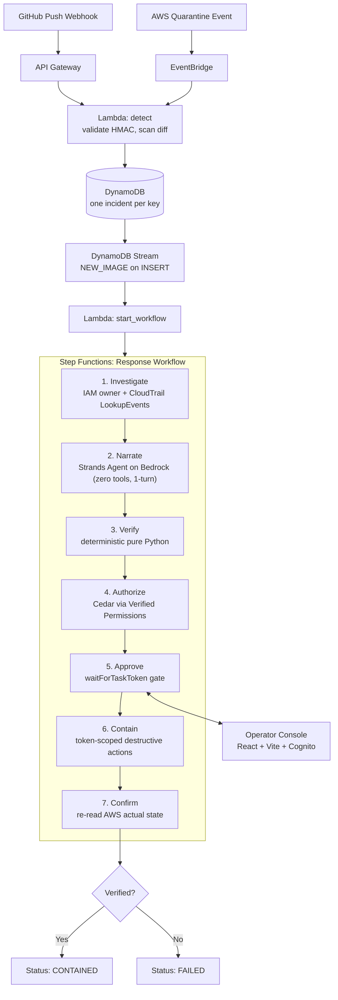

# KILLSWITCH

> Your AWS keys leaked. KILLSWITCH pulls the plug.

[](https://killswitch-console.onrender.com/#console)
[](https://youtu.be/UeyZnTPyJDg)
[](tests/)
[](pyproject.toml)
[](infra/)
[](docs/CREDITS.md)

---

## Overview

An engineer commits an active AWS access key to a git repository. Automated scrapers find the exposed credential within five minutes and launch unauthorized EC2 compute instances across multiple AWS regions minutes later. KILLSWITCH detects the leak via webhook or AWS quarantine event, reconstructs the attacker's blast radius through multi-region CloudTrail audit queries, generates a containment plan using a sandboxed language model, verifies every proposed action against recorded audit facts using deterministic code, and waits for explicit operator approval before deactivating the key, terminating attacker-spawned instances, and revoking active sessions.

---

## Submission Links

| Deliverable | URL | Details |
|---|---|---|
| **Live Web Console** | [https://killswitch-console.onrender.com/#console](https://killswitch-console.onrender.com/#console) | Deployed operator console with interactive fixture mode & demo workflows |
| **Demo Video (3 min)** | [https://youtu.be/UeyZnTPyJDg](https://youtu.be/UeyZnTPyJDg) | 3-minute video walkthrough (leak, attack, verifier rejection, containment) |
| **Source Code** | [https://github.com/Atul-Chahar/KILLSWITCH](https://github.com/Atul-Chahar/KILLSWITCH) | Full repository with 4 CDK stacks, pure Python verifier, and 374 automated tests |

### Deep-Dive Technical Documentation

| Document | What it proves |
|---|---|
| [docs/ARCHITECTURE.md](docs/ARCHITECTURE.md) | End-to-end event pipeline, DynamoDB Stream trigger, CloudTrail polling loop, and API Gateway integration |
| [docs/SAFETY.md](docs/SAFETY.md) | The four-layer defense boundary, token-scoped containment, and single-IAM-statement blast shield |
| [docs/VERIFIER-LIMITS.md](docs/VERIFIER-LIMITS.md) | The verifier contract, provenance rules, omission blindspots, and untrusted model prose handling |
| [docs/DECISIONS.md](docs/DECISIONS.md) | Architectural trade-offs, why actions were cut (role chaining, second-round investigation), and why deactivate was chosen over delete |
| [docs/LIMITATIONS.md](docs/LIMITATIONS.md) | Complete inventory of 22 documented limitations, synthetic test fixtures, and unverified AWS execution boundaries |
| [docs/DEMO.md](docs/DEMO.md) | Exact 3-minute video timeline, rehearsal checklist, and verifier rejection demonstration |
| [docs/RUNBOOK.md](docs/RUNBOOK.md) | Step-by-step AWS account setup, stack deployment, attack execution, and teardown commands |
| [docs/AI-TOOLS.md](docs/AI-TOOLS.md) | AI tool disclosures, test-first RED/GREEN commit history, and model boundary specifications |
| [docs/CREDITS.md](docs/CREDITS.md) | Open-source dependencies, font licensing, and Unit 42 research citations |

---

## The Problem

Unit 42 (Palo Alto Networks) documented in their *EleKtra-Leak* research that threat actors discover exposed AWS credentials on public repositories **within five minutes** of exposure. Automated scripts weaponize the stolen keys, launching EC2 compute instances across regions roughly seven minutes later.

AWS provides an automated quarantine mechanism when it detects a compromised key. While useful, AWS's native quarantine leaves substantial security gaps:

| Capability | AWS Compromised Key Quarantine | Commercial Secret Scanners | KILLSWITCH |
|---|---|---|---|
| Trigger on public repository leaks | Yes (monitored platforms) | Yes | Yes (GitHub webhook + Quarantine event) |
| Trigger on private repository leaks | No | Yes (alerts only) | Yes (HMAC-verified push webhook) |
| Terminate attacker-launched instances | No | No | Yes (gated by human approval) |
| Invalidate existing active STS sessions | Partial | No | Yes (IAM `aws:TokenIssueTime` condition) |
| Reconstruct CloudTrail blast radius | No | No | Yes (multi-region `LookupEvents` query) |
| Deterministic action verification | No | No | Yes (pure Python provenance verifier) |
| Operator web approval console | No | Alerting dashboard | Yes (React + Vite single-page application) |

Most commercial tools only alert. An on-call engineer must manually investigate what the key touched, decide what to destroy, and confirm the result under severe time pressure. KILLSWITCH automates the forensic investigation and verification while keeping the human in control of execution.

---

## Architecture



```
[GitHub Push / AWS Quarantine]
       │
       ▼
[API Gateway / EventBridge] ──► [Lambda: detect] ──► [DynamoDB: incidents]
                                                            │ (Stream INSERT)
                                                            ▼
                                                   [Step Functions Workflow]
                                                            │
  ┌─────────────────────────────────────────────────────────┴──────────────────────────────────────┐
  │                                                                                                │
  ▼                                                                                                ▼
1. Investigate ──► 2. Narrate ──► 3. Verify ──► 4. Authorize ──► 5. Approve ──► 6. Contain ──► 7. Confirm
  (CloudTrail)       (Bedrock)      (Pure AST)      (Cedar)     (waitForToken)  (Deactivate)   (Re-read AWS)
                                                                       ▲
                                                                       │
                                                            [Operator Web Console]
```

---

## The Rule This System Is Built On

> **The model proposes. Plain code verifies. A human approves.**

Every operation in KILLSWITCH maps strictly to one of these three boundaries:

| Phase | Responsibility | Implementation File | Safety Guarantee |
|---|---|---|---|
| **The model proposes** | Structured reasoning over forensic evidence | [narrate/agent.py](file:///Users/mac/.gemini/antigravity-ide/scratch/KILLSWITCH/narrate/agent.py)<br/>[narrate/schema.py](file:///Users/mac/.gemini/antigravity-ide/scratch/KILLSWITCH/narrate/schema.py) | Constructed with `tools=[]`. It possesses no tools and cannot execute code or AWS APIs. Locked to `limits={"turns": 1}` so it cannot retry past schema failures. |
| **Plain code verifies** | Mathematical provenance checking | [verifier/verify.py](file:///Users/mac/.gemini/antigravity-ide/scratch/KILLSWITCH/verifier/verify.py)<br/>[verifier/plan.py](file:///Users/mac/.gemini/antigravity-ide/scratch/KILLSWITCH/verifier/plan.py) | Pure Python functions. Zero network calls, zero AWS SDK imports, zero model SDK imports. Enforced by AST linting tests in [tests/test_verifier.py](file:///Users/mac/.gemini/antigravity-ide/scratch/KILLSWITCH/tests/test_verifier.py). Drops any action targeting resources not created by the leaked key. |
| **A human approves** | Authorization and execution gating | [authorize/decide.py](file:///Users/mac/.gemini/antigravity-ide/scratch/KILLSWITCH/authorize/decide.py)<br/>[workflow/approval_api.py](file:///Users/mac/.gemini/antigravity-ide/scratch/KILLSWITCH/workflow/approval_api.py)<br/>[containment/guard.py](file:///Users/mac/.gemini/antigravity-ide/scratch/KILLSWITCH/containment/guard.py) | Step Functions suspends on `waitForTaskToken`. Destructive containment functions refuse execution without an approval token scoped to that exact action ID and approval round. |

---

## Safety Model

```
READS                              HUMAN GATE                    WRITES
CloudTrail, IAM, diff       ──►    Per-Action Approval     ──►   Deactivate Key
(Read-only Lambda role)            (Cedar / Verified Perms       Terminate Instances
                                    + Task Token Gate)           Revoke Active Sessions
                                                                       │
                                                                       ▼
                                                             POST-ACTION CONFIRMATION
                                                             Re-read IAM/EC2 + Audit Log
```

### Enforced Safety Invariants

1. **Tool-less Agent Sandbox:** The Strands narrator is instantiated with `tools=[]` and a hard one-turn limit, eliminating tool execution and schema negotiation attacks.
2. **Pure AST-Verified Verifier:** The verifier module contains zero `boto3`, `strands`, or HTTP dependencies, checked at build time via Python AST inspection.
3. **Round-Scoped Approval Tokens:** Destructive actions require cryptographic approval tokens bound to the incident ID, action ID, and approval round.
4. **Single-Statement Blast Shield:** Exactly one statement in the CDK CloudFormation synthesis grants `ec2:TerminateInstances` and `iam:UpdateAccessKey`.
5. **No Assumed Success:** Post-action confirmation queries the real AWS APIs; an unconfirmed state fails the execution rather than reporting success.
6. **Safe Denial Path:** Human-denied actions leave target resources untouched, record an audit entry, and resolve the incident state to `declined` instead of `failed`.

---

## AWS Services Used

Every service listed below is part of the automated pipeline and visible in the demo workflow:

| AWS Service | Operational Function | Implementation Source |
|---|---|---|
| **Amazon API Gateway** | Receives HMAC-signed GitHub push webhooks and serves the Cognito-authenticated operator API | [infra/stacks/detection.py](file:///Users/mac/.gemini/antigravity-ide/scratch/KILLSWITCH/infra/stacks/detection.py)<br/>[infra/stacks/console_api.py](file:///Users/mac/.gemini/antigravity-ide/scratch/KILLSWITCH/infra/stacks/console_api.py) |
| **Amazon EventBridge** | Ingests AWS Compromised Key Quarantine events to trigger automated response | [infra/stacks/detection.py](file:///Users/mac/.gemini/antigravity-ide/scratch/KILLSWITCH/infra/stacks/detection.py)<br/>[detect/quarantine.py](file:///Users/mac/.gemini/antigravity-ide/scratch/KILLSWITCH/detect/quarantine.py) |
| **AWS Lambda** | Executes isolated stages: detection, CloudTrail polling, agent narration, verifier logic, and containment | [detect/handler.py](file:///Users/mac/.gemini/antigravity-ide/scratch/KILLSWITCH/detect/handler.py)<br/>[workflow/tasks.py](file:///Users/mac/.gemini/antigravity-ide/scratch/KILLSWITCH/workflow/tasks.py) |
| **AWS Step Functions** | Coordinates state execution, handles evidence polling loops, and halts for operator decisions via `waitForTaskToken` | [infra/stacks/response.py](file:///Users/mac/.gemini/antigravity-ide/scratch/KILLSWITCH/infra/stacks/response.py) |
| **Amazon Bedrock** | Hosts foundation models accessed by Strands Agents SDK to synthesize incident summaries and plans | [narrate/agent.py](file:///Users/mac/.gemini/antigravity-ide/scratch/KILLSWITCH/narrate/agent.py) |
| **Amazon Verified Permissions** | Evaluates Cedar policies to enforce human approval requirements for destructive actions | [authorize/decide.py](file:///Users/mac/.gemini/antigravity-ide/scratch/KILLSWITCH/authorize/decide.py)<br/>[authorize/policies/containment.cedar](file:///Users/mac/.gemini/antigravity-ide/scratch/KILLSWITCH/authorize/policies/containment.cedar) |
| **AWS CloudTrail** | Provides immutable management audit logs queried by `LookupEvents` across regions | [investigate/cloudtrail.py](file:///Users/mac/.gemini/antigravity-ide/scratch/KILLSWITCH/investigate/cloudtrail.py) |
| **Amazon DynamoDB** | Stores incident states, task tokens, and append-only audit entries; streams new records via DynamoDB Streams | [shared/incidents.py](file:///Users/mac/.gemini/antigravity-ide/scratch/KILLSWITCH/shared/incidents.py)<br/>[workflow/start.py](file:///Users/mac/.gemini/antigravity-ide/scratch/KILLSWITCH/workflow/start.py) |
| **AWS IAM** | Resolves key ownership, deactivates compromised credentials, and attaches inline session-revocation deny policies | [investigate/identify.py](file:///Users/mac/.gemini/antigravity-ide/scratch/KILLSWITCH/investigate/identify.py)<br/>[containment/actions.py](file:///Users/mac/.gemini/antigravity-ide/scratch/KILLSWITCH/containment/actions.py) |
| **Amazon EC2** | Targets attacker-spawned instances in `ap-south-1` and `us-east-1` for verified termination | [containment/actions.py](file:///Users/mac/.gemini/antigravity-ide/scratch/KILLSWITCH/containment/actions.py) |
| **Amazon Cognito & AWS Amplify** | Authenticates incident operators and hosts the React single-page management console | [infra/stacks/console_api.py](file:///Users/mac/.gemini/antigravity-ide/scratch/KILLSWITCH/infra/stacks/console_api.py)<br/>[console/src/App.tsx](file:///Users/mac/.gemini/antigravity-ide/scratch/KILLSWITCH/console/src/App.tsx) |

---

## What Is Proven, and How

Every core capability is verified by automated test suites or verifiable repository artifacts:

| Capability | Verification Mechanism | Test or Artifact Location |
|---|---|---|
| **Secret Scanning & Signature Check** | 36 unit tests for regex patterns, example key exclusion, and HMAC validation | [tests/test_detect_patterns.py](file:///Users/mac/.gemini/antigravity-ide/scratch/KILLSWITCH/tests/test_detect_patterns.py)<br/>[tests/test_detect_webhook.py](file:///Users/mac/.gemini/antigravity-ide/scratch/KILLSWITCH/tests/test_detect_webhook.py) |
| **Idempotent Ingestion** | Race condition tests for dual triggers writing identical incident IDs | [tests/test_detect_handler.py](file:///Users/mac/.gemini/antigravity-ide/scratch/KILLSWITCH/tests/test_detect_handler.py)<br/>[tests/test_incidents.py](file:///Users/mac/.gemini/antigravity-ide/scratch/KILLSWITCH/tests/test_incidents.py) |
| **CloudTrail Forensic Reconstruction** | Multi-region pagination and typed `EvidenceProblem` handling against synthetic fixtures | [tests/test_blast_radius.py](file:///Users/mac/.gemini/antigravity-ide/scratch/KILLSWITCH/tests/test_blast_radius.py)<br/>[tests/test_identify.py](file:///Users/mac/.gemini/antigravity-ide/scratch/KILLSWITCH/tests/test_identify.py) |
| **Verifier Provenance Enforcement** | 41 tests proving rejection of unowned instances, wrong regions, foreign keys, and AST purity | [tests/test_verifier.py](file:///Users/mac/.gemini/antigravity-ide/scratch/KILLSWITCH/tests/test_verifier.py)<br/>[tests/test_narrate_adversarial.py](file:///Users/mac/.gemini/antigravity-ide/scratch/KILLSWITCH/tests/test_narrate_adversarial.py) |
| **Human Approval Task Token Gate** | State machine pause tests and token rejection assertions | [tests/test_approval_api.py](file:///Users/mac/.gemini/antigravity-ide/scratch/KILLSWITCH/tests/test_approval_api.py)<br/>[tests/test_containment.py](file:///Users/mac/.gemini/antigravity-ide/scratch/KILLSWITCH/tests/test_containment.py) |
| **Token-Gated Containment & Revocation** | Execution refusal without token, key deactivation, instance termination, and session revocation | [tests/test_containment.py](file:///Users/mac/.gemini/antigravity-ide/scratch/KILLSWITCH/tests/test_containment.py)<br/>[tests/test_end_state.py](file:///Users/mac/.gemini/antigravity-ide/scratch/KILLSWITCH/tests/test_end_state.py) |
| **Single Blast-Shield IAM Statement** | Synthesized CloudFormation template assertion checking IAM grant count | [tests/test_response_stack.py](file:///Users/mac/.gemini/antigravity-ide/scratch/KILLSWITCH/tests/test_response_stack.py) |
| **End-to-End Incident Lifecycle** | 31 full pipeline integration tests from signed webhook push to confirmed containment | [tests/test_workflow_end_to_end.py](file:///Users/mac/.gemini/antigravity-ide/scratch/KILLSWITCH/tests/test_workflow_end_to_end.py)<br/>[tests/test_integration_wiring.py](file:///Users/mac/.gemini/antigravity-ide/scratch/KILLSWITCH/tests/test_integration_wiring.py) |
| **Operator Console & Workflow Rail** | 16 Vitest tests; desktop, fixture, and 390px mobile visual evidence captures | [console/src/stages.test.ts](file:///Users/mac/.gemini/antigravity-ide/scratch/KILLSWITCH/console/src/stages.test.ts)<br/>[evidence/](file:///Users/mac/.gemini/antigravity-ide/scratch/KILLSWITCH/evidence/) |

---

## Quickstart

### Prerequisites
- Python >= 3.12
- Node.js >= 18
- `uv` (recommended) or standard `python3 -m venv`

### Installation and Validation

```bash
# Clone the repository
git clone https://github.com/Atul-Chahar/KILLSWITCH.git
cd KILLSWITCH

# Configure environment variables
cp .env.example .env

# Install backend dependencies in virtual environment
make install

# Install console frontend dependencies
make console-install

# Run the complete test gate (secret scanner, ruff, mypy, pytest, vitest, console build)
make check
```

### Running Tests Directly

```bash
# Run 358 Python unit and integration tests
source .venv/bin/activate && pytest

# Run 16 console Vitest tests
npm --prefix console test -- --run

# Run the static secret leakage check
bash scripts/check_secrets.sh
```

### Running the Operator Console

You can access the operator console in two ways:

1. **Live Cloud Deployment:** Open **[https://killswitch-console.onrender.com/#console](https://killswitch-console.onrender.com/#console)** directly in your browser.
2. **Local Fixture Mode:**
   ```bash
   cd console && npm run dev
   ```
   Navigate to `http://localhost:5173/#console` in your browser. The console boots in fixture mode, populating an active incident with multi-region instances, verifier strike-outs, and functional approve/deny buttons.

---

## Demo Walkthrough

The 3-minute video demonstration is available on YouTube at **[https://youtu.be/UeyZnTPyJDg](https://youtu.be/UeyZnTPyJDg)** and follows the chronological script defined in [docs/DEMO.md](docs/DEMO.md):

| Timestamp | Screen | Event & Voiceover Point |
|---|---|---|
| **0:00 – 0:20** | Threat Context | Real-world problem: AWS keys scraped from GitHub in minutes and monetized via unauthorized EC2 clusters. |
| **0:20 – 0:50** | The Leak & Attack | Git commit with AWS credential pushed. Attacker script (`scripts/demo_attack.sh`) launches `t3.micro` instances in `ap-south-1` and `us-east-1`, plus mints a secondary key. |
| **0:50 – 1:20** | Detection & Timeline | Webhook catches the leak. Step Functions initiates CloudTrail forensic query. Blast radius table displays discovered attacker resources. |
| **1:20 – 1:45** | Verifier Rejection | The model proposes actions. Plain code verifier detects an unowned bystander instance (`i-0999999999ffffff9`), striking it out on screen with the reason *"this leaked key never created it"*. |
| **1:45 – 2:15** | Mobile Approval | Operator reviews the incident on mobile. Approves key deactivation and valid instance terminations. Step Functions releases task token, terminates instances, and revokes sessions. |
| **2:15 – 2:35** | The Denial Path | Operator explicitly denies an action. The denied target is left untouched, logged as `declined`, and the incident finishes in a `declined` state. |
| **2:35 – 3:00** | Post-Action Verification | Confirmation stage queries AWS APIs to verify confirmed end state. Architecture walkthrough highlights Step Functions task tokens and Bedrock integration. |

---

## Limitations

This section documents the project's boundaries, unverified assumptions, and cut features, expanded in full in [docs/LIMITATIONS.md](docs/LIMITATIONS.md):

### Execution and Cloud State
- **Zero live AWS execution to date:** All 374 tests run against in-memory fakes, moto stubs, or synthetic fixtures. No stack has been deployed to live AWS infrastructure.
- **Synthetic CloudTrail fixtures:** `tests/fixtures/*.json` are hand-crafted against AWS documentation rather than captured from real AWS API queries.
- **Simulated quarantine trigger:** Because the demo repository is private for safety, AWS's public compromised key quarantine is simulated via `scripts/simulate_quarantine.py`.

### Evidence and Forensic Latency
- **CloudTrail ingestion latency:** Management events take 5–15 minutes to appear in `LookupEvents`. The investigation stage polls CloudTrail, so containment speed is bound by AWS audit log ingestion time.
- **Role chaining blindspot:** Queries inspect actions by `AccessKeyId`. If an attacker invokes `sts:AssumeRole`, subsequent actions occur under temporary credentials invisible to this single-key query.
- **Incomplete attacker persistence:** Tracks `RunInstances` and `CreateAccessKey`. Actions like `CreateUser`, `AttachUserPolicy`, or console password generation are not tracked.
- **Static blast radius during approval wait:** Resources launched while an operator is reviewing the plan are omitted from the active plan and rejected if added later.

### Scope and Safety Boundaries
- **Verifier cannot detect omission:** The verifier validates actions that are present. An empty plan passes clean. The UI mitigates this by flagging unaddressed blast radius resources.
- **Scope limited to two resource types:** Only EC2 instances and IAM access keys are handled. S3, Lambda, RDS, and DynamoDB are not supported.
- **Auto Scaling groups unmanaged:** Terminating an instance in an ASG triggers automatic replacement by AWS.
- **GitHub PR opener is stubbed:** `containment/actions.py:open_pull_request` raises `NotImplementedError` rather than generating mock pull requests.
- **Strict 1-turn model execution:** The Strands agent retry mechanism is disabled (`limits={"turns": 1}`), so malformed model output fails immediately without retry.

---

## Credits and AI Tools

- Open source components, research citations, and prior art disclosures are cataloged in [docs/CREDITS.md](docs/CREDITS.md).
- AI toolchain usage, prompt evolution, and test-first RED/GREEN commit history are documented in [docs/AI-TOOLS.md](docs/AI-TOOLS.md).
